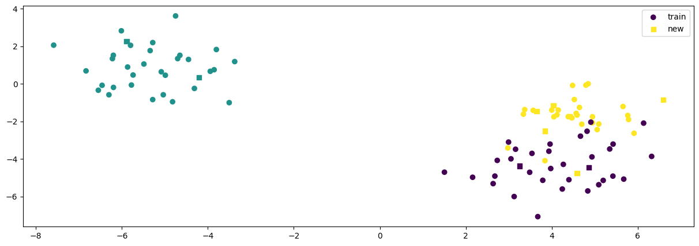
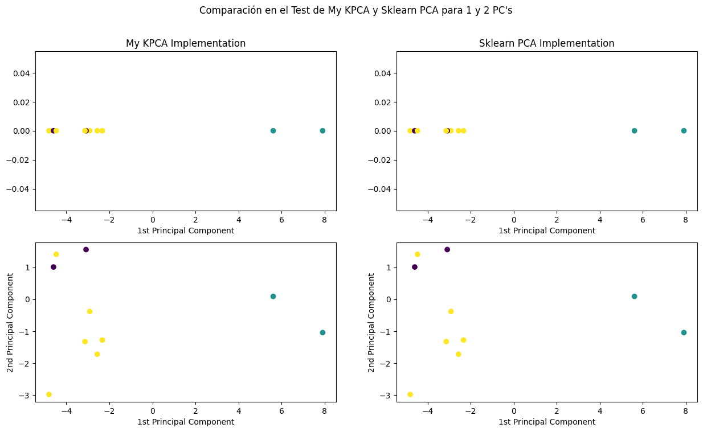
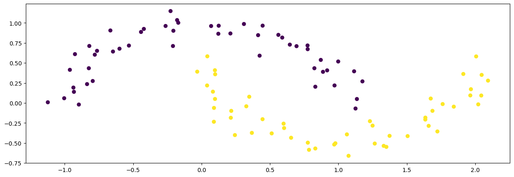
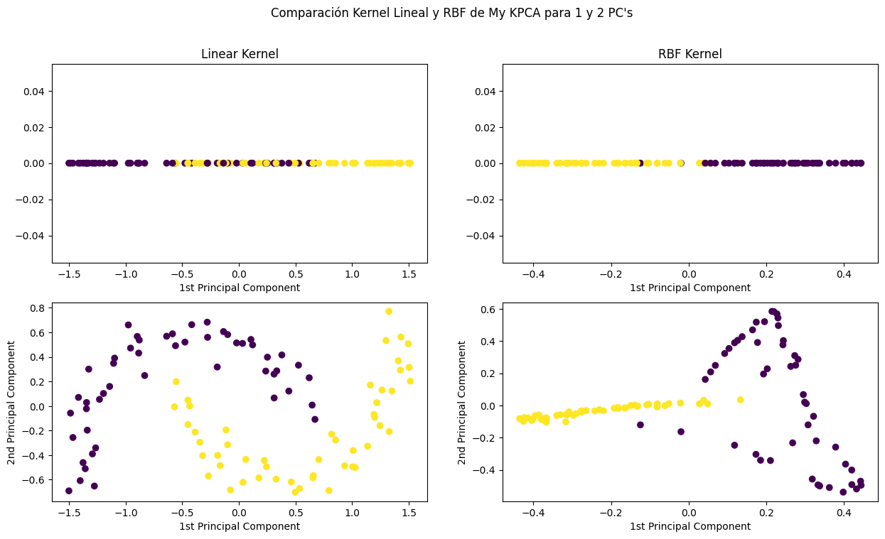

# Kernel-PCA Implementation

This project features an implementation of Kernel Principal Component Analysis (K-PCA). K-PCA is a non-linear dimensionality reduction and feature extraction technique that applies a kernel transformation (kernel trick), mapping the data into a higher-dimensional space where conventional Principal Component Analysis (PCA) is subsequently performed.

## Key Concepts of the Kernel PCA Algorithm
1. **Kernel Trick**: Transforms the original data into a higher-dimensional space using a kernel function, allowing for the capture of non-linear relationships.
2. **Dimensionality Reduction**: Reduces the number of dimensions in the data while preserving as much variance as possible.
3. **Non-linear Mapping**: Uses non-linear kernels (e.g., Gaussian, polynomial) to reveal structures not apparent in the original feature space.
4. **Eigen Decomposition**: Applies eigen decomposition on the kernel matrix to extract principal components in the transformed space.
5. **Flexibility**: Different kernel functions (e.g., linear, Gaussian, polynomial) can be used to suit various types of data.

## Self Implementation vs. Sklearn Implementation

Both implementations yield similar results in data projection.

### Data Projection Comparison
- **Data 1:**  
  

- **Performance with Linear Kernel (equivalent to conventional PCA):**  
  

## Linear vs. Gaussian Kernel Using the Self Implementation
- **Data 2:**  
  

- **Performance with Linear and Gaussian Kernels:**  
  

